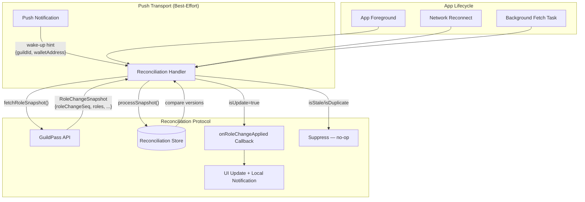
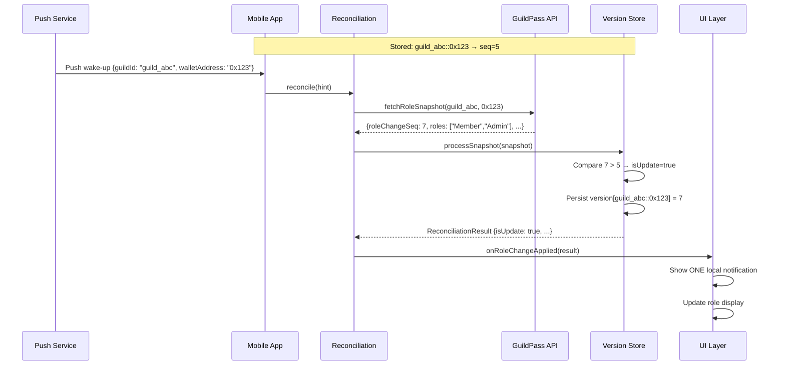
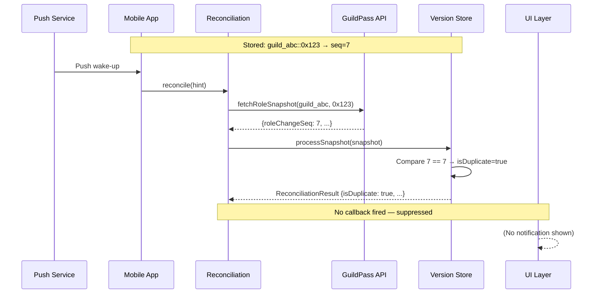
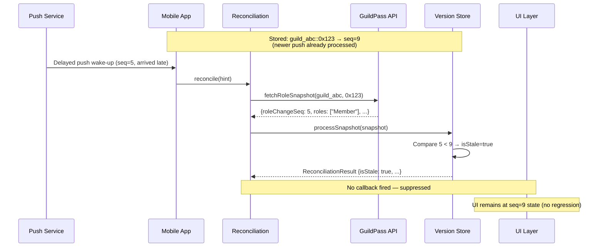
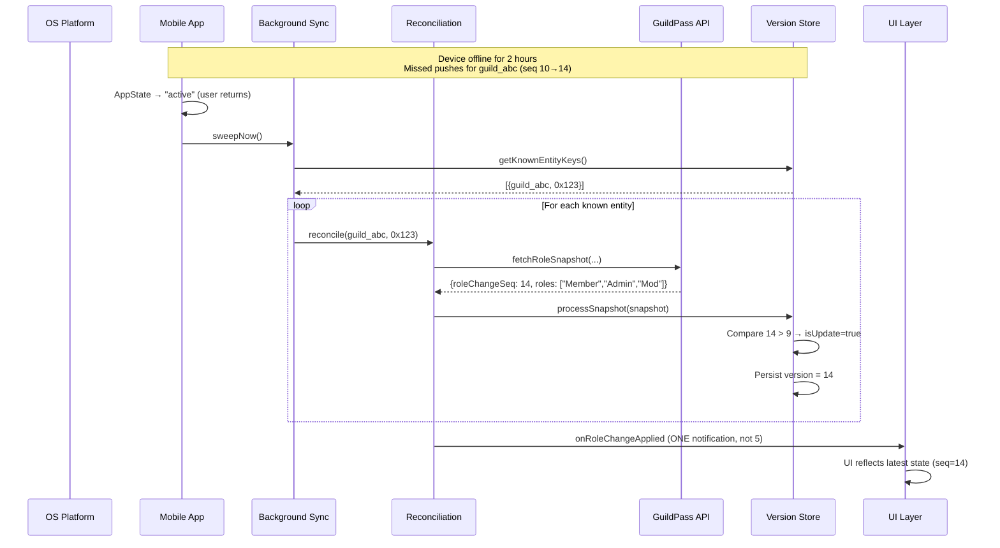

# Push Notification Reconciliation Protocol

> **Status:** Implemented  
> **Related issue:** #23 — Push notifications for role updates  
> **Module:** `src/features/notifications/`

---

## Overview

Push notifications are inherently **best-effort**: messages can be dropped, delayed, duplicated, or delivered out of order, especially across app restarts or extended offline periods. The reconciliation protocol ensures correctness by treating every push notification as a **wake-up hint** rather than a trusted data source.

### Key design principles

| Principle                     | Implementation                                                                                                   |
| ----------------------------- | ---------------------------------------------------------------------------------------------------------------- |
| **Push is only a hint**       | Push payloads contain only entity identifiers (`guildId`, `walletAddress`); data is never trusted directly.      |
| **Authoritative fetch**       | Every wake-up triggers a full server round-trip to fetch the true current role/membership state.                 |
| **Monotonic versioning**      | A per-entity `roleChangeSeq` (monotonic sequence number) detects duplicates and out-of-order delivery.           |
| **At-most-once notification** | Duplicate or stale wake-ups are suppressed; only genuine state transitions produce user-facing alerts.           |
| **Offline resilience**        | A periodic background sweep + foreground event trigger catch up on missed pushes after extended offline periods. |

---

## Architecture



---

## Sequence Diagrams

### 1. Normal Flow — Single Push, Genuine Update



### 2. Duplicate Push — Suppressed



### 3. Out-of-Order Push — Stale Delivery Suppressed



### 4. Extended Offline Period — Background Catch-Up



---

## Data Model

### `ReconciliationStore` (persisted to AsyncStorage)

```typescript
{
  "guild_abc::0x1234567890123456789012345678901234567890": 14,
  "guild_xyz::0xabcdef0123456789abcdef0123456789abcdef01": 3
}
```

- Key: `"{guildId}::{walletAddress.toLowerCase()}"` composite key.
- Value: highest `roleChangeSeq` the client has seen and applied (monotonic, never decreases).

### `RoleChangeSnapshot` (server response)

| Field              | Type       | Description                                                         |
| ------------------ | ---------- | ------------------------------------------------------------------- |
| `guildId`          | `string`   | Guild identifier                                                    |
| `walletAddress`    | `string`   | Wallet address                                                      |
| `roleChangeSeq`    | `number`   | Monotonic sequence number — strictly increases on every role change |
| `roles`            | `string[]` | Current role names for this entity                                  |
| `membershipActive` | `boolean`  | Whether the wallet holds active membership                          |

---

## Usage

### 1. In a push notification handler

```typescript
import { useReconciliation } from "src/features/notifications";

function PushHandler() {
  const { reconcile } = useReconciliation({
    onRoleChangeApplied: (result) => {
      // Only fired for genuine, non-stale, non-duplicate updates
      showLocalNotification({
        title: "Role Updated",
        body: `Your roles in ${result.entityKey.guildId} have changed.`,
      });
    },
  });

  // Called when a push notification arrives
  const handlePush = async (data: { guildId: string; walletAddress: string }) => {
    await reconcile(data);
  };

  return; /* ... */
}
```

### 2. Background sync (root component)

```typescript
import { useBackgroundSync } from "src/features/notifications";

function RootLayout() {
  useBackgroundSync({
    onRoleChangeApplied: (result) => {
      // Handle missed updates caught by the sweep
    },
  });

  return; /* ... */
}
```

### 3. Platform-level background fetch registration

```typescript
import { registerBackgroundSyncTask } from "src/features/notifications";

// Call once at app init (e.g., in _layout.tsx)
useEffect(() => {
  registerBackgroundSyncTask();
}, []);
```

---

## Testing Strategy

| Scenario                              | Expected behavior                                   | Test file                                           |
| ------------------------------------- | --------------------------------------------------- | --------------------------------------------------- |
| Duplicate push delivery               | Exactly ONE notification, ONE state update          | `tests/reconciliation/reconciliation.store.test.ts` |
| Out-of-order push (older after newer) | Stale push suppressed, UI not regressed             | `tests/reconciliation/reconciliation.store.test.ts` |
| Extended offline → reconnect          | Missed changes caught up; ONE notification (not N)  | `tests/reconciliation/useReconciliation.test.ts`    |
| Fetch failure during reconciliation   | Graceful degradation, no crash, store not corrupted | `tests/reconciliation/useReconciliation.test.ts`    |
| Store persistence across restarts     | Versions survive app kill/relaunch                  | `tests/reconciliation/reconciliation.store.test.ts` |
| Wallet clear on sign-out              | All versions for wallet removed                     | `tests/reconciliation/reconciliation.store.test.ts` |

---

## SDK Contract Requirements

The reconciliation protocol requires the GuildPass SDK (`@guildpass/sdk`) to expose a `roleChangeSeq` field on membership responses. Until that field is available, the client falls back to `updatedAt` or `0`, which is safe but may cause the first fetch after an upgrade to be treated as an update.

**Recommended SDK addition:**

```typescript
interface MembershipResponse {
  // ... existing fields
  /** Monotonic sequence number incremented on every role change. */
  roleChangeSeq: number;
}
```
